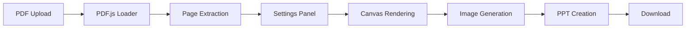

# 🎯 PDF to PPT Converter

A modern, browser-based web application that converts PDF files to PowerPoint presentations with advanced customization options.


## ✨ Features

### Core Features
- 📄 **PDF to PPT Conversion** - Convert each PDF page to PowerPoint slides
- 🎨 **Multiple Slide Sizes** - Support for 16:9, 4:3, A4, and Letter formats
- 🎯 **Quality Control** - Choose from Standard, High, or Very High quality
- 📐 **Flexible Fit Modes** - Fit to slide, fill slide, or original size
- 📑 **Page Range Selection** - Convert all pages or specify a custom range
- 📦 **Direct Download** - Get your .pptx file instantly

### Privacy & Performance
- 🔒 **100% Private** - All processing happens in your browser, files never leave your device
- 🚀 **No Backend Required** - Pure frontend application, no server needed
- 💰 **Completely Free** - No API keys, subscriptions, or hidden costs
- ⚡ **Fast Processing** - Efficient client-side conversion

### User Experience
- 📱 **Responsive Design** - Works on desktop, tablet, and mobile
- ✨ **Modern UI** - Beautiful design with gradients and smooth animations
- 🎛️ **Intuitive Controls** - Easy-to-use settings panel
- 📊 **Progress Tracking** - Real-time conversion progress

## 🚀 Quick Start

### Prerequisites
- Node.js 16+ and npm

### Installation

```bash
# Clone the repository
git clone https://github.com/yourusername/pdf-to-ppt-converter.git

# Navigate to project directory
cd pdf-to-ppt-converter

# Install dependencies
npm install

# Start development server
npm run dev
```

Open your browser and navigate to `http://localhost:5173`

## 📖 Usage

### Step 1: Upload PDF
- Drag and drop a PDF file onto the upload area
- Or click to browse and select a file
- Maximum file size: 50MB

### Step 2: Configure Settings

#### Slide Size
Choose from:
- **16:9 (Widescreen)** - Modern presentation format
- **4:3 (Standard)** - Classic presentation format
- **A4 Paper** - European paper size
- **Letter** - US paper size

#### Image Quality
- **Standard** - Faster processing, smaller file size
- **High** - Balanced quality and size (recommended)
- **Very High** - Best quality, larger file size

#### Fit Mode
- **Fit to Slide** - Maintains aspect ratio, fits within slide bounds
- **Fill Slide** - Fills entire slide, may crop edges
- **Original Size** - Preserves original dimensions

#### Page Range
- **All Pages** - Convert entire PDF
- **Custom Range** - Specify start and end pages

### Step 3: Start Conversion
- Click "Start Conversion" button
- Watch the progress indicator
- Processing happens entirely in your browser

### Step 4: Download Results
- Click "Download PowerPoint" to get your .pptx file
- File is named based on original PDF filename

### Step 5: Convert Another
- Click "Convert Another PDF" to process more files

## 🏗️ How It Works



1. **PDF Loading** - Uses [PDF.js](https://mozilla.github.io/pdf.js/) to parse PDF files
2. **Page Extraction** - Extracts individual pages from the PDF
3. **Settings Configuration** - User selects conversion options
4. **Canvas Rendering** - Each page is rendered to HTML5 Canvas at specified quality
5. **Image Generation** - Canvas converted to high-quality PNG images
6. **PPT Creation** - [PptxGenJS](https://gitbrent.github.io/PptxGenJS/) creates PowerPoint with images
7. **Download** - [FileSaver.js](https://github.com/eligrey/FileSaver.js/) triggers download

All processing happens entirely in your browser - no server involved!

## 📁 Project Structure

```
pdf-to-ppt-converter/
├── src/
│   ├── components/
│   │   ├── FileUpload.jsx          # Drag-and-drop upload
│   │   ├── ConversionSettings.jsx  # Settings panel
│   │   ├── ProgressIndicator.jsx   # Progress tracking
│   │   ├── PreviewPanel.jsx        # PDF preview
│   │   └── DownloadButton.jsx      # Download interface
│   ├── utils/
│   │   ├── pdfProcessor.js         # PDF → Image conversion
│   │   └── pptGenerator.js         # Image → PPT conversion
│   ├── App.jsx                     # Main application
│   ├── main.jsx                    # React entry point
│   └── index.css                   # Global styles
├── public/
│   └── favicon.svg                 # App icon
├── index.html                      # HTML template
├── package.json                    # Dependencies
└── vite.config.js                  # Vite config
```

## 🚀 Build for Production

```bash
# Build the application
npm run build

# Preview production build
npm run preview
```

The built files will be in the `dist/` folder, ready to deploy.

## 🌐 Deployment

Deploy to any static hosting service:

### Render (Recommended)

1. Sign up at [render.com](https://render.com)
2. Create a new Static Site
3. Connect your GitHub repository
4. Configure:
   - Build Command: `npm install && npm run build`
   - Publish Directory: `dist`
5. Deploy!

### Netlify

```bash
npm run build
# Drag and drop the dist/ folder to Netlify
```

Or use Netlify CLI:
```bash
npm install -g netlify-cli
netlify deploy --prod
```

### Vercel

```bash
# Connect your GitHub repo to Vercel
# It will auto-detect Vite and deploy
```

Or use Vercel CLI:
```bash
npm install -g vercel
vercel --prod
```

### GitHub Pages

```bash
npm run build
# Upload dist/ folder to gh-pages branch
```

## ⚙️ Configuration

### Default Conversion Settings

Edit `src/App.jsx` to change defaults:

```javascript
const [settings, setSettings] = useState({
  slideSize: '16:9',     // Default slide size
  quality: 2,            // 1=Standard, 2=High, 3=Very High
  fitMode: 'fit',        // 'fit', 'fill', or 'original'
  pageRange: 'all',      // 'all' or 'range'
  startPage: 1,
  endPage: null
});
```

### Image Quality Levels

Edit `src/utils/pdfProcessor.js`:

```javascript
// Quality scale factor (1=72dpi, 2=144dpi, 3=216dpi)
const scale = quality; // 1, 2, or 3
```

### File Size Limit

Edit `src/components/FileUpload.jsx`:

```javascript
const maxSize = 50 * 1024 * 1024; // 50MB (default)
```

## 🌐 Browser Compatibility

- ✅ Chrome (latest)
- ✅ Firefox (latest)
- ✅ Edge (latest)
- ✅ Safari (latest)
- ✅ Mobile browsers

## 🐛 Troubleshooting

### "Failed to load PDF"
- Ensure the file is a valid PDF
- Check if the file is corrupted
- Try a smaller PDF file

### "Browser crashed" or "Out of memory"
- The PDF is too large for browser memory
- Try reducing file size or page count
- Close other browser tabs
- Use a lower quality setting

### Images look blurry
- Increase the quality setting to "High" or "Very High"
- Note: Higher quality = slower processing and larger file size

### Download doesn't start
- Check browser popup blocker settings
- Ensure JavaScript is enabled
- Try a different browser

## 🛠️ Tech Stack

- **React 18.3** - UI framework
- **Vite 5.0** - Build tool and dev server
- **PDF.js 4.0** - PDF parsing and rendering
- **PptxGenJS 3.12** - PowerPoint generation
- **FileSaver.js 2.0** - File download handling

## 📄 License

MIT License - feel free to use this project for personal or commercial purposes.

## 🙏 Acknowledgments

- [PDF.js](https://mozilla.github.io/pdf.js/) - Mozilla's PDF rendering library
- [PptxGenJS](https://gitbrent.github.io/PptxGenJS/) - PowerPoint generation library
- [FileSaver.js](https://github.com/eligrey/FileSaver.js/) - Client-side file saving

## 📊 Stats

- 🎯 100% client-side processing
- 🔒 Zero data collection
- ⚡ No server costs
- 💰 Completely free forever

---

Made with ❤️ using React and modern web technologies
